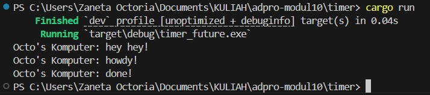
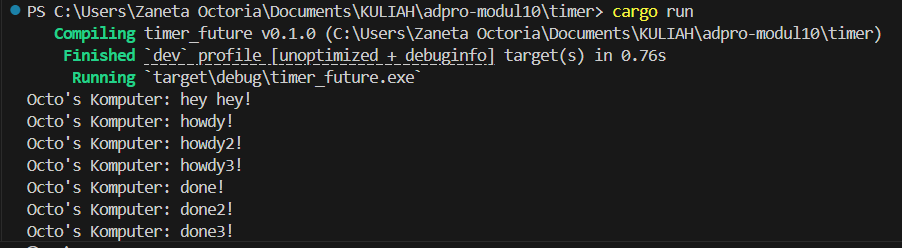
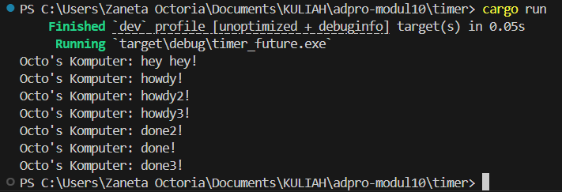

# Reflection
## Understanding How It Works

The addition of println!("Octo's Komputer: hey hey!"); is executed on the main thread, immediately, before the executor starts running. It produces extra output right before the asynchronous execution begins, without affecting the async task itself. This indicates that the program doesn't jump straight into the async task; instead, there's a step that runs on the main thread first.

## Multiple Spawns and Removing Drop

**Spawning** means registering an async task to be executed later — it doesn't run the task immediately.

A **spawner** is used to register tasks, not to execute them. The **executor** is responsible for fetching and running tasks from the queue.

**Dropping the spawner** signals to the executor that no new tasks will be added.

The spawner registers async tasks into a queue. Then, the executor processes that queue and runs the tasks. When the spawner is dropped, it informs the executor that no more tasks will be submitted.

When we register multiple tasks, **"Howdy!"** will be printed first because the executor runs tasks concurrently. If a future isn't ready, the executor doesn’t wait — it moves on to another task.

If we remove the part where the spawner is dropped, the program keeps running but does nothing. This happens because the executor is still waiting to be told that no more tasks are coming.
